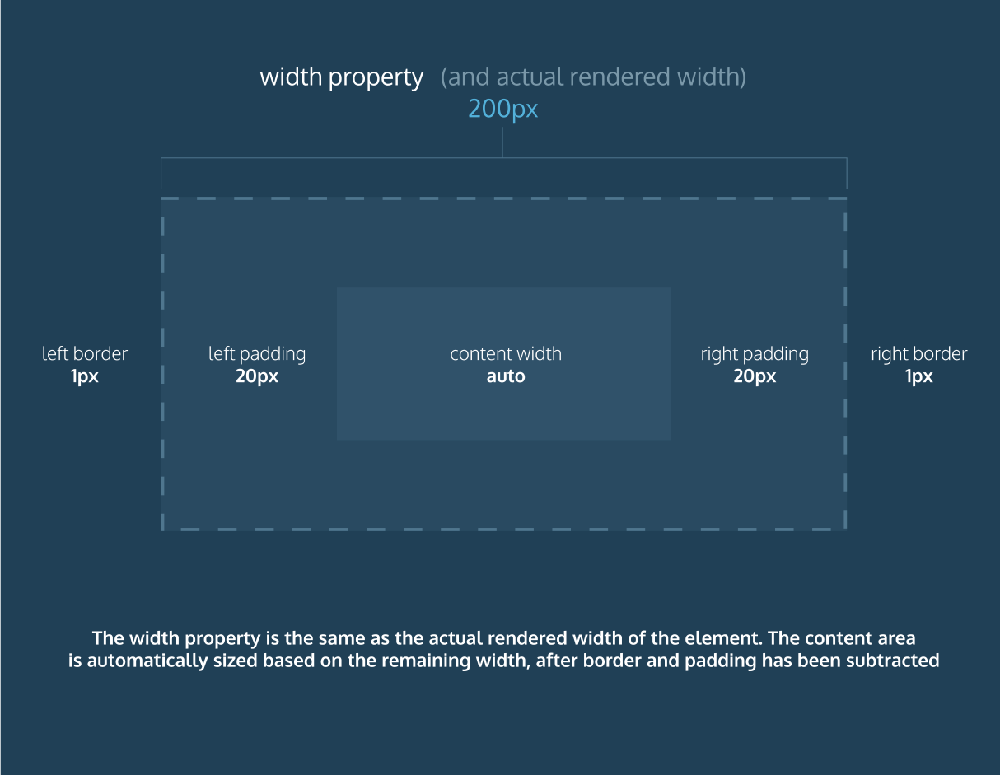

# Learn CSS course notes

### Quick Refference
```html
<!-- set the class of a paragraph to some_class -->
<p class="some_class">body</p> 
```
resetting all browser default stylesheets:
```css
* {
  margin: 0;
  padding: 0;
}
```
cheat sheet
```css
visibility: hidden; ##hides element
visibility: visible; ##displays element
```
```css
h1 {
  color: maroon;
}
/*select all h1 tags and color them maroon.*/

.selected_class {
    body
}
/*apply body to all elements with class selected_class*/

#selected_id{
    body
}
/*apply body to all elements with id selected_id*/

p {
  color: blue !important;
}
/*using !important is the highest level of specificity and should be avoided. */
h5,
p{
  font-family: Georgia;
}
/* define multiple at once*/

  min-height: 150px;
  max-height: 300px;
  min-width #— this property ensures a minimum width of an element's box.
  max-width #— this property ensures a maximum width of an element's box.


```
Examples
```css
.main-banner {
  background-image: url("https://www.example.com/image.jpg");
}

.image {
  background-image: url("https://s3.amazonaws.com/codecademy-content/courses/web-101/unit-4/htmlcss1-img_soccer.jpeg");
  background-size: cover;
  background-position: center;
  height: 300px;
}

h1 {
  color: red;
  background-color: blue;
}

.overlay {
  opacity: 0.5;
}

p {
  font-family: Helvetica;
  font-size: 18px;
  color: AliceBlue;
  line-height: 1.3em;
  text-align: left;
  width: 100%;
}

```


### Inline Styles
>Although CSS is a different language than HTML, it's possible to write CSS code directly within HTML code using inline styles.
To style an HTML element, you can add the style attribute directly to the opening tag. After you add the attribute, you can set it equal to the CSS style(s) you'd like applied to that element.
```html
<p style="color: red;">I'm learning to code!</p>
```
The code in the example above demonstrates how to use inline styling. The paragraph element has a style attribute within its opening tag. Next, the style attribute is set equal to color: red;, which will set the color of the paragraph text to red within the browser.
If you'd like to add more than one style with inline styles, simply keep adding to the style attribute. Make sure to end the styles with a semicolon (;).
```html
<p style="color: red; font-size: 20px;">I'm learning to code!</p>
```

### The `<style>` Tag
>Inline styles are a fast way of styling HTML, but they also have limitations. If you wanted to style, for example, multiple `<h1>` elements, you would have to add inline styling to each element manually. In addition, you would also have to maintain the HTML code when additional `<h1>` elements are added.
Fortunately, HTML allows you to write CSS code in its own dedicated section with the `<style>` element. CSS can be written between opening and closing `<style>` tags. To use the `<style>` element, it must be placed inside of the `<head>` element.
```html
<head>
  <style>


  </style>
</head>
```html
After adding a `<style>` tag in the head section, you can begin writing CSS code.
```html
<head>
  <style>
    p {
      color: red;
      font-size: 20px;
    }
  </style>
</head>
```
### Linking the CSS File
- Good practice is to keep CSS files and HTML files seperate.
>When HTML and CSS code are in separate files, the files must be linked. Otherwise, the HTML file won't be able to locate the CSS code, and the styling will not be applied.
You can use the `<link>` element to link HTML and CSS files together. The `<link>` element must be placed within the head of the HTML file. It is a self-closing tag and requires the following three attributes:
`href` — like the anchor element, the value of this attribute must be the address, or path, to the CSS file.
`type` — this attribute describes the type of document that you are linking to (in this case, a CSS file). The value of this attribute should be set to text/css.
`rel` — this attribute describes the relationship between the HTML file and the CSS file. Because you are linking to a stylesheet, the value should be set to stylesheet.
When linking an HTML file and a CSS file together, the `<link>` element will look like the following:
```html
<link href="https://www.codecademy.com/stylesheets/style.css" type="text/css" rel="stylesheet">
```

### Selecting Tag Name
>CSS can select HTML elements by using an element's tag name. A tag name is the word (or character) between HTML angle brackets.
For example, in HTML, the tag for a paragraph element is `<p>`. The CSS syntax for selecting `<p>` elements is:

```html
p {

}
```
>In the example above, all paragraph elements will be selected using a CSS selector. The selector in the example above is p. Note that the CSS selector matches the HTML tag for that element, but without the angle brackets.
In addition, two curly braces follow immediately after the selector (an opening and closing brace, respectively). Any CSS properties will go inside of the curly braces to style the selected elements.

### Multiple Classes

>We can use CSS to select an HTML element's class attribute by name.
So far, we've selected elements using only one class name per element. If every HTML element had a single class, all the style information for each element would require a new class.
Luckily, it's possible to add more than one class name to an HTML element's class attribute.
For instance, perhaps there's a heading element that needs to be green and bold. You could write two CSS rules like so:

```css
.green {
  color: green;
}

.bold {
  font-weight: bold;
}
```
>Then, you could include both of these classes on one HTML element like this:
`<h1 class="green bold"> ... </h1>`
**We can add multiple classes to an HTML element's class attribute by separating them with a space.** 
This enables us to mix and match CSS classes to create many unique styles without writing a custom class for every style combination needed.

### Classes and IDs
>CSS can select HTML elements by their tag, class, and ID. CSS classes and IDs have different purposes, which can affect which one you use to style HTML elements.
CSS classes are meant to be reused over many elements. By writing CSS classes, you can style elements in a variety of ways by mixing classes on HTML elements.
For instance, imagine a page with two headlines. One headline needs to be bold and blue, and the other needs to be bold and green. Instead of writing separate CSS rules for each headline that repeat each other's code, it's better to write a .bold CSS rule, a .green CSS rule, and a .blue CSS rule. Then you can give one headline the bold green classes, and the other the bold blue classes.
While classes are meant to be used many times, an ID is meant to style only one element. As we'll learn in the next exercise, IDs override the styles of tags and classes. Since IDs override class and tag styles, they should be used sparingly and only on elements that need to always appear the same.

### Specificity

>Specificity is the order by which the browser decides which CSS styles will be displayed. A best practice in CSS is to style elements while using the lowest degree of specificity, so that if an element needs a new style, it is easy to override.
IDs are the most specific selector in CSS, followed by classes, and finally, tags.

### Chaining Selectors
>When writing CSS rules, it's possible to require an HTML element to have two or more CSS selectors at the same time.
This is done by combining multiple selectors, which we will refer to as chaining. For instance, if there was a .special class for h1 elements, the CSS would look like:
```css
h1.special {
body
}
```
The code above would select only the h1 elements that have a class of special. If a p element also had a class of special, the rule in the example would not style the paragraph.

### Nested Elements
>In addition to chaining selectors to select elements, CSS also supports selecting elements that are nested within other HTML elements. For instance, consider the following HTML:
```html
<ul class='main-list'>
  <li> ... </li>
  <li> ... </li>
  <li> ... </li>
</ul>
```
>The nested <li> elements are selected with the following CSS:
```css
.main-list li {
body 
}
```
>In the example above, .main-list selects the .main-list element (the unordered list element). The nested `<li>` are selected by adding li to the selector, separated by a space, resulting in .main-list li as the final selector (note the space in the selector).
Selecting elements in this way can make our selectors even more specific by making sure they appear in the context we expect.

### Chaining and Specificity
>In the last exercise, instead of selecting all h5 elements, you selected only the h5 elements nested inside the .description elements. This CSS selector was more specific than writing only h5. Adding more than one tag, class, or ID to a CSS selector increases the specificity of the CSS selector.
>For instance, consider the following CSS:

```css
p {
  color: blue;
}

.main p {
  color: red;
}
```
>Both of these CSS rules define what a p element should look like. Since .main p has a class and a p tag as its selector, only the p elements inside the .main element will appear red. This occurs despite there being another more general rule that states p elements should be blue.

### Multiple Selectors

>In order to make CSS more concise, it's possible to add CSS styles to multiple CSS selectors all at once. This prevents writing repetitive code.
For instance, the following code has repetitive style attributes:

```css
h1 {
  font-family: Georgia;
}

.menu {
  font-family: Georgia;
}
```
>Instead of writing font-family: Georgia twice for two selectors, we can separate the selectors by a comma to apply the same style to both, like this:

```css
h1, 
.menu {
  font-family: Georgia;
}
```
>By separating the CSS selectors with a comma, both the h1 and the .menu elements will receive the font-family: Georgia styling.

### CSS Structure

To style an HTML element using CSS, you need to write a CSS declaration inside the body of a CSS selector.
```css
h1 {
  color: blue;
}
```
The example above selects the `<h1>` element. Inside of the selector's body, we typed color: blue. This line is referred to as a CSS declaration. CSS declarations consist of a property and a value.

Property — the property you'd like to style of that element (i.e., size, color, etc.).

Value — the value of the property (i.e., 18px for size, blue for color, etc.).

In the example above, the property is color and the value is blue. The property and value are separated by a colon (:). A semicolon (;) should always be used at the end of a declaration.

Finally, the entire snippet of code in the example above is known as a CSS rule or rule set. A CSS rule consists of the selector (here, h1) and all declarations inside of the selector.

### Text Align

No matter how much styling is applied to text (typeface, size, weight, etc.), text always appears on the left side of the browser.

To align text we can use the text-align property. The text-align property will align text to the element that holds it, otherwise known as its parent.
```css
h1 {
  text-align: right;
}
```
The text-align property can be set to one of the following three values:

`left` — aligns text to the left hand side of its parent element, which in this case is the browser.
`center` — centers text inside of its parent element.
`right` — aligns text to the right hand side of its parent element.

### The Box Model


##### Height and Width
>An element's content has two dimensions: a height and a width. By default, the dimensions of an HTML box are set to hold the raw contents of the box.
The CSS height and width properties can be used to modify these default dimensions.

##### Borders
A border is a line that surrounds an element, like a frame around a painting. Borders can be set with a specific width, style, and color.

- width — The thickness of the border. A border's thickness can be set in pixels or with one of the following keywords: thin, medium, or thick.

- style — The design of the border. Web browsers can render any of 10 different styles. Some of these styles include: none, dotted, and solid.

- color — The color of the border. Web browsers can render colors using a few different formats, including 140 built-in color keywords.

```css
p {
  border: 3px solid coral;
}
```
>In the example above, the border has a width of 3 pixels, a style of solid and a color of coral. All three properties are set in one line of code.

##### Border Radius

The border-radius attribute enables non-square borders

```css
div.container {
  border: 3px solid rgb(22, 77, 100);
  border-radius: 5px;
}
```

alternatively, to make circular borders you can use
`border-radius: 100%;`

###### Image example
```css
#banner {
  background-image: url("https://s3.amazonaws.com/codecademy-content/courses/web-101/unit-6/htmlcss1-img_tahoe.jpeg");
  background-size: cover;
  background-position: bottom center;
  height: 700px;
  width: 100%;
  border-radius: 15px;
}
```
```html
  <div id="banner">
    <div class="content">
      <h1>Conservation Efforts at Lake Tahoe Being Praised by Nation's Leaders</h1>
    </div>
  </div>
```


##### Padding

Does what it says on the tin. Here's some useful syntax:
```css
padding
padding-top
padding-right
padding-bottom
padding-left
padding: 6px 11px 4px 9px;
```
>In the example above, the four values 6px 11px 4px 9px correspond to the amount of padding in a clockwise rotation.

##### Margins

The *don't fucking touch me* space between elements.
```css
margin-top
margin-right
margin-bottom
margin-left
margin: 6px 10px 5px 12px;
```
A useful piece of syntax is `auto`
```css
div.headline {
  width: 400px;
  margin: 0 auto;
}
```
The auto works as an automatic centering parameter. In this example, auto is used in place of a width attribute. 
**NOTE: You have to specify the width of the element otherwise it wont centralise.**

##### Margin Collapse

**NOTE: Margin Collapse doesn't apply to padding**

Horizontal margins (left and right), like padding, are always displayed and added together. For example, if two divs with ids `#div-one` and `#div-two`, are next to each other, they will be as far apart as the sum of their adjacent margins.
```css
#img-one {
  margin-right: 20px;
}

#img-two {
  margin-left: 20px;
}
```
In this example, the space between the `#img-one` and `#img-two` borders is 40 pixels. The right margin of #img-one (20px) and the left margin of #img-two (20px) add to make a total margin of 40 pixels.

Unlike horizontal margins, vertical margins do not add. Instead, the larger of the two vertical margins sets the distance between adjacent elements.
```css
#img-one {
  margin-bottom: 30px;
}

#img-two {
  margin-top: 20px;
}
```
In this example, the vertical margin between the `#img-one` and `#img-two` elements is 30 pixels. Although the sum of the margins is 50 pixels, the margin collapses so the spacing is only dependent on the #img-one bottom margin.

##### Min/Max element sizes and Overflow
You can fix the maximum and minimum sizes an element can be resized to using the following syntax
```css
  min-height: 150px;
  max-height: 300px;
  min-width
  max-width
```
You can use the `overflow` keyword to control what happens when children elements are larger than their parent elements.
```css
p {
  overflow: scroll; 
}
```

the three states for `overflow` are:
>`hidden` - when set to this value, any content that overflows will be hidden from view.
`scroll` - when set to this value, a scrollbar will be added to the element's box so that the rest of the content can be viewed by scrolling.
`visible` - when set to this value, the overflow content will be displayed outside of the containing element. Note, this is the default value.

#### The Border-Box model
Introduced as an alternative to the standard box model. It instead uses the `width` property to define the *entire* width of the element, padding included. This was designed in an attempt to make dealing with elements and making sure they all work together easier.

It can be initialised by using 
```css
* {
  box-sizing: border-box;
}
```
at the beggining of the code.


The figure above demonstrates the difference in `width` property between border-box and box models.

### Display and Positioning
##### `position` property
can be set to any of the following:
```css
position: relative; /* when combined with offset properties, this anchors all offsetting relative to it's original position. */
position: absolute; /* places the element at an absolute position on the page. All other elements act as though it isn't there.*/
position: fixed; /* fixes the element to the SCREEN position, I.e. it will move with the screen as you scroll. */ 
position: static;
```
Additionally, `top` and `left` properties can be used to offset the position.

```css
top: 20px;
left: 30px;
```
the `z-index` is used to establish a heirachy for fixed and absolute elements, in terms of what overlaps what.

```css
z-index: 2;
```
an element with a `z-index` of `2` will appear above one with an index of `1`.
These guys come together to make some extremely handsome and powerful possibilities.

### `display`

>`inline` elements take up as little space as possible, and they cannot have manually-adjusted width or height.
`block` elements take up the width of their container and can have manually-adjusted heights.
`inline-block` elements can have set width and height, but they can also appear next to each other and do not take up their entire container width.

```css
display:inline;
display:inline-box
```

### `float` and `clear`

`float` is a property which can have values `left` or `right`, which glue the element to the left or right of the page.

>The clear property specifies how elements should behave when they bump into each other on the page. It can take on one of the following values:
`left` — the left side of the element will not touch any other element within the same containing element.
`right` — the right side of the element will not touch any other element within the same containing element.
`both` — neither side of the element will touch any other element within the same containing element.
`none` — the element can touch either side.

### Colors

Colors can be described with `hex`, `keywords` or `rgb(r,g,b)`.

`hex` colors take the format `#000000`. This example is the hex form of black. In hex color, each pair of hexadecimal characters represents the amount of red, green and blue to form the 6 figure tag.

`rgb` color uses the same principles, but it's far more literal in it's representation of the amount of red green and blue.
```css
rgb(25,135,15)
rgba(25,135,15,0.5) #Transparency included version.
```

Each quantity of red, green and blue may vary between 1-256.

An alternative color representation is *HSL*, which follows
```css
hsl(125,50%,60%)
hsla(325, 50%, 50%, 0.6)
```
where the first arg is the **angle** on a color wheel, the second is **saturation** percentage and the third **lightness** percentage. In the second example, `hsla` the fourth argument is the *alpha*, and represents transparency.

### Typography

>- Typography is the art of arranging text on a page.
>- Text can appear in any number of weights, with the font-weight property.
>- Text can appear in italics with the font-style property.
>- The vertical spacing between lines of text can be modified with the line-height property.
>- Serif fonts have extra details on the ends of each letter. Sans-Serif fonts do not.
>- Fallback fonts are used when a certain font is not installed on a user's computer.
>- Google Fonts provides free fonts that can be used in an HTML file with the <link> tag or the @font-face property.
>- Local fonts can be added to a document with the @font-face property and the path to the font's source.
>- The word-spacing property changes how far apart individual words are.
>- The letter-spacing property changes how far apart individual letters are.
>- The text-align property changes the horizontal alignment of text.

## CSS grids

##### Initialization

>To set up a grid, you need to have both a grid container and grid items. The grid container will be a parent element that contains grid items as children and applies overarching styling and positioning to them.
To turn an HTML element into a grid container, you must set the element's display property to grid (for a block-level grid) or inline-grid (for an inline grid). Then, you can assign other properties to lay out the grid.

##### Columns

We can define the columns and rows of our grid by using the CSS property `grid-template-columns` and `grid-template-rows` respectively.

```css
.grid {
  display: grid;
  border: 2px blue solid;
  width: 400px;
  height: 500px;
  grid-template-columns: 100px 50% 200px;
  grid-template-rows: 40% 50% 50px;
}
```
Here the number of arguments indicates it will have 3 columns/rows.

Alternatively one can use the more succint `grid-template: rows / colums;`

```css
.grid {
  display: grid;
  width: 1000px;
  height: 500px;
  grid-template: 200px 300px / 20% 10% 70%;
}
```

##### `fr` unit

the fraction (`fr`) unit is a unit measure for grids. It has the following form:

```css
.grid {
  display: grid;
  width: 100px;
  grid-template-columns: 1fr 60px 1fr;
}
```
As one would expect instinctively, it is a unit measure based around all availible space.

##### `repeat()` function
for grids, the repear function may be given as an argument instead.
`grid-template-columns: repeat(3, 100px)`
is equivalent to
`grid-template-columns: 100px 100px 100px;`

The second argument can take multiple values such as:
`grid-template-columns: repeat(2, 20px 50px)`

will generate 4 colums of alternating width 20px and 50px.
Learn FLEXBOX

##### `minmax()` function

Example:
```css
grid-template-columns: 100px minmax(100px, 500px) 100px;
```

Minmax may be used to set a width which scales with the page between a minimum and a maximum. It requires that no width be set for the grid.

##### Grid gap

Used to insert gaos between rows. Detracts from available space so works with fractions.

```css
  grid-row-gap: 20px;
  grid-column-gap: 5px;
```
or the compacted:
```css
  grid-gap: 20px, 5px;
```

##### Grid Items

>In all of our examples, the items placed in the grid have always taken up exactly one square. This does not always need to be the case; we can drastically change the look of our grid by making grid items take up more than one row and one column. 

span rows/colums by editing the **item's** CSS with:
```css
.item {
  grid-row-start: 1;
  grid-row-end: 3;
}
```
or, compacted:
```css
.item {
  grid-row: 4 / 6;
}
```
>Row grid lines and column grid lines start at 1 and end at a value that is 1 greater than the number of rows or columns the grid has. For example, if a grid has 5 rows, the grid row lines range from 1 to 6. If a grid has 8 columns, the grid row lines range from 1 to 9.

the `span n` key word can be used to indicate how many rows/columns the gird should span. e.g.

```css
.b {
  grid-column: 2 /span 6;
  grid-row: 2 / span 3;
}
```

##### `grid-area: x_1 / y_1 / x_2 / y_2;`
A refactoring which includes all of the above into one succinct line.
the ordering of arguments is as follows:
>grid-row-start
grid-column-start
grid-row-end
grid-column-end

##### `grid-template-areas`

This property key enables you to define the areas of a grid with labels, instead of using the `grid-row-start` etc terms. 

`grid-template-area` is a property given to the **containing** element, and `grid-area` to it's **child** elements. `grid-template-area` defines and allocates space, and `grid-area` assigns child elements to that space.

Syntax example:
```css
.container {
  display: grid;
  max-width: 900px;
  position: relative;
  margin: auto;
  grid-template-areas: "head head"
                       "nav nav" 
                       "info services"
                       "footer footer";
  grid-template-rows: 300px 120px 800px 120px;
  grid-template-columns: 1fr 3fr; 
}

header {
  grid-area: head;
} 
```

##### Overlap

using afforeseen methods, we can place elements all over the page. In the case where we have overlapping elements, we can determine what overlaps what with the `z-index` property.

An example for `overlap` class elements:
```css
.overlap {
  grid-area: 6 / 4 / 8 / 6;
  background-color: lightcoral;
  z-index: 5;
}
```

### Aligning content in grids

##### `justify-items`

Elements are positioned within their columns with the `justify-items` value in the container element.

`justify-items` values can be from the following:

>`start` — aligns grid items to the left side of the grid area
`end` — aligns grid items to the right side of the grid area
`center` — aligns grid items to the center of the grid area
`stretch` — stretches all items to fill the grid area

Example usage:
```css
main {
  display: grid;
  grid-template-columns: repeat(3, 400px);
  justify-items: center;
}
```

##### `justify-content`

`justify-content` dictates how grid items are aligned in the grid.
Some values of `justify-content` are:

>`start` — aligns the grid to the left side of the grid container
`end` — aligns the grid to the right side of the grid container
`center` — centers the grid horizontally in the grid container
`stretch` — stretches the grid items to increase the size of the grid to expand horizontally across the container
`space-around` — includes an equal amount of space on each side of a grid element, resulting in double the amount of space between elements as there is before the first and after the last element
`space-between` — includes an equal amount of space between grid items and no space at either end
`space-evenly` — places an even amount of space between grid items and at either end

##### `align-items`

`align-items` is a property of the grid container, and defines the vertical (column/block) alignment of the content in the grid, e.g content starts filling up the grid area from the bottom/top/center.

Some arguments `align-items` takes are:
>`start` — aligns grid items to the top side of the grid area
`end` — aligns grid items to the bottom side of the grid area
`center` — aligns grid items to the center of the grid area
`stretch` — stretches all items to fill the grid area

##### `align-content`

`align-content` works much the same way as `justify-content`, but for vertical spacing. Again, here are some arguments it accepts:

>`start` — aligns the grid to the top of the grid container
`end` — aligns the grid to the bottom of the grid container
`center` — centers the grid vertically in the grid container
`stretch` — stretches the grid items to increase the size of the grid to expand vertically across the container
`space-around` — includes an equal amount of space on each side of a grid element, resulting in double the amount of space between elements as there is before the first and after the last element
`space-between` — includes an equal amount of space between grid items and no space at either end
`space-evenly` — places an even amount of space between grid items and at either end

##### Aligning `self`
>The `justify-items` and `align-items` properties specify how all grid items contained within a single container will position themselves along the row and column axes, respectively.
>`start` — positions grid items on the left side/top of the grid area
`end` — positions grid items on the right side/bottom of the grid area
`center` — positions grid items on the center of the grid area
`stretch` — positions grid items to fill the grid area (default)

### Implicit grids

Grids have the `grid-auto-rows` and `grid-auto-columns` properties to describe how additional elements which exceed the designated grid spacings are displayed.

Additionally, `grid-auto-flow` determines the order in which new elements will fill up the grid.

>`row` — specifies the new elements should fill rows from left to right and create new rows when there are too many elements (default)
`column` — specifies the new elements should fill columns from top to bottom and create new columns when there are too many elements
`dense` — this keyword invokes an algorithm that attempts to fill holes earlier in the grid layout if smaller elements are added

>You can pair `row` and `column` with dense, like this: `grid-auto-flow: row dense`;

```css
body {
  display: grid;
  grid: repeat(2, 100px) / repeat(2, 150px); 
  grid-auto-rows: 50px;
}
```

##### Review

>`grid-template-areas` specifies grid named grid areas
grid layouts are two-dimensional: they have a row, or inline, axis and a column, or block, axis.
`justify-items` specifies how individual elements should spread across the row axis
`justify-content` specifies how groups of elements should spread across the row axis
`justify-self` specifies how a single element should position itself with respect to the row axis
`align-items` specifies how individual elements should spread across the column axis
`align-content` specifies how groups of elements should spread across the column axis
`align-self` specifies how a single element should position itself with respect to the column axis
`grid-auto-rows` specifies the height of rows added implicitly to the grid
`grid-auto-columns` specifies the width of columns added implicitly to the grid
`grid-auto-flow` specifies in which direction implicit elements should be created